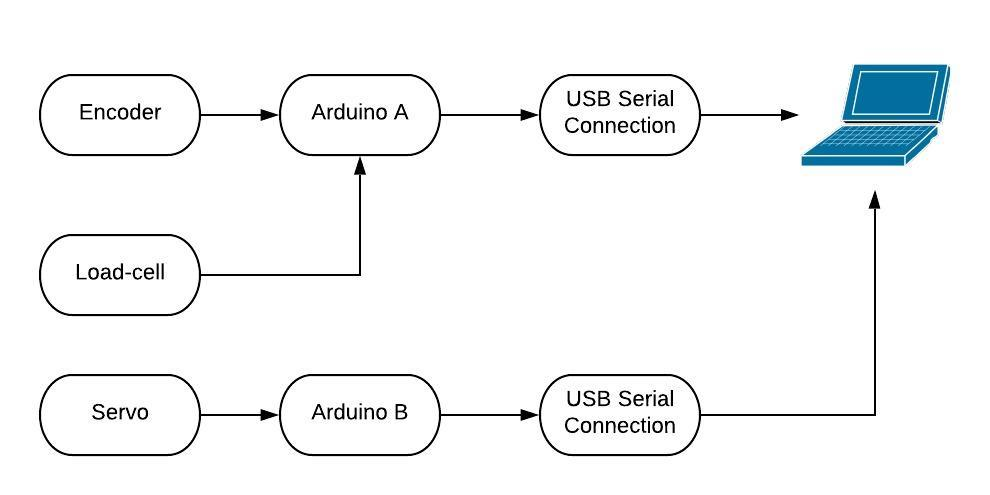

# Experiment Setup

* `Arduino`: Arduino code to interface servos and sensors via MATLAB
* `Diagnostics`: Code for horn centering, bluetooth configuration, and sensor calibration
* `Resources`: Data-sheets for any equipment used
* `closeExperiment.m`: Closes all connections
* `initExperiment.m`: Initializes servo, sensors, and serial/bluetooth connections
* `example.m`: An example driver for the servo and sensors
* `fishHandler.m`: Choose to write a position to the servo (radians) and/or read from the sensors. See below for more details

---

## Setup Instructions

1. Upload `CenterServo.ino` and open up the serial monitor, in the bottom right-hand corner set the baudrate to `9600 baud` and `No line ending` (or else your commands will be registered twice). Type any number into the prompt and press enter to send adjustments to the Arduino. These numerical adjustments  increase or decrease the PWM signal reflecting the servo's current position. Repeat this process until the horn is centered, record this adjustment.

2. Upload `BT_configuration` to the Arduino controlling the load-cell to automatically configure the bluetooth module to the proper settings to connect with MATLAB.

3. Upload `SparkFun_HX711_Calibration` to the Arduino controlling the load-cell. Follow the directions in the program header comments of the `.ino` file to find the calibration number, record this number

4. Upload Arduino code in the `Arduino` folder to their respective Arduino boards

5. In your script, to use the servo first initialize things by calling `initServo(serialPort, baudRate, centerAdjustment, microSecondsToDegrees)`:
 * `serialPort`: Which COM port Arduino is connected to, written as `'COM1'` for COM port 1 (on Windows machines, if on MAC write `/dev/tty.KeySerial1`, or Linux as `/dev/ttyS0`)
 * `baudRate`: This should match the `baudRate` parameter in `Servo_Arduino.ino`, keep this at 9600
 * `centerAdjustment`: Write the adjustment found in step 2
 * `microSecondsToDegrees`: For the Hitec D845-WP the travel (degrees) per microsecond is 0.101° based on [this data-sheet](https://www.servocity.com/d845wp-servo), so a 30° servo sweep roughly correlates to 300 µs PWM written to the servo. I would use ServoCity's website to get more specific information (perhaps Hitec provides more detailed information somewhere, but I've found their own data-sheets to be lacking)

	E.g., an Arduino connected via COM port 12 on a 9600 baud serial connection for the Hitec D845-WP is initialized with: `initServo('COM12', 9600, 145, 0.101)`

6. Move the servo by calling `writeServoDeg(angle, flags)`, where `angle` is the angle of the flapper with respect to its resting position (parallel to the spine) in degrees. To control the input/output include or omit flags in `flags`. Indicate `l` or `L` to return a reading from the load-cell and/or `e` or `E` to return a reading from the encoder. Indicate `s` or `S` to write `angle` to the servo. If `l/L/e/E` are omittted then no reading is taken (returns 0) and if `s/S` is omitted then the servo remains stationary.

	E.g. moving the flapper 30° to the left while reading from the load-cell is called by:

 `myLoadCellReading = writeServoDeg(30, 'ls')`

 To only move the flapper one could call `(30, 's')`, but to only read the load-cell one could use the function call (which ignores `angle`):

 `myLoadCellReading = writeServoDeg(30, 'l')` 

 The return variable `myLoadCellReading` is actually a 1x4 array: 
 	
 	`[loadcell_reading_time, loadcell_reading, encoder_reading_time, encoder_reading]`
 
 See the given example code in `servo_Example.m` which plots the load-cell readings with respect to time (in seconds).

7. Close the serial connection with the Arduino by calling `closeServo()`
